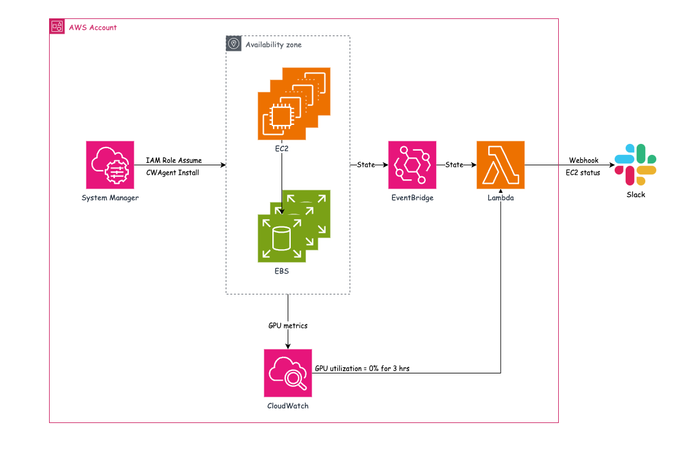

# finops


This project aims to automate cloud resource management (finops) and is planned to advance in three main directions:

1. **Monitoring**: Automatically monitor the status and changes of AWS resources (such as EC2 instances).
2. **Alerting**: Instantly send alerts to Slack or other communication platforms when abnormal or important events are detected.
3. **Optimization**: In the future, automatically analyze resource usage and provide cost optimization suggestions or automated adjustments.

Currently, the "Monitoring" and "Alerting" core features have been implemented: This project provides an AWS Lambda function that automatically sends notifications to Slack based on EC2 instance state changes. The Lambda is triggered by EventBridge rules and all resources are managed using Infrastructure as Code (IaC).



*The above is a simple architecture diagram of this project, illustrating the automated flow from AWS events through EventBridge and Lambda to Slack.*

## Project Structure

```
├── app/
│   └── lambda_function.py   # Main entry point for the Lambda function
│   └── slack/
│       └── slack_templates.py # Slack message formatting templates
├── iac/
│   ├── cloudformation/      # CloudFormation templates (e.g., eventbridge.json)
│   └── iam/                # IAM Policy definitions (e.g., information-readonly-policy.json)
├── .env                    # Environment variable config for Slack webhook, AWS parameters, etc.
├── .env.example            # Example environment file
├── Makefile                # Makefile for build, test, and deployment commands
├── README.md               # Project documentation
└── ...
```

- `app/lambda_function.py`: Main Lambda function code, processes events from EventBridge and sends notifications to Slack.
- `app/slack/slack_templates.py`: Contains functions to generate different Slack message block structures.
- `iac/`: Contains IaC files, including CloudFormation and IAM Policy, for automated AWS resource deployment.
- `.env`: Environment variable configuration file. Please fill in Slack Webhook URL, AWS parameters, and other sensitive information (do not commit to version control).
- `.env.example`: An example file to show the required environment variables.
- `Makefile`: Provides convenient commands for building the Docker image, testing locally, and deploying the Lambda function.

## Prerequisites

*   Docker
*   AWS CLI (configured with necessary permissions)
*   AWS SAM CLI (for local testing)
*   **Execution Environment:** The build and deployment commands (`make build`, `make deploy`, etc.) are designed to be executed on an EC2 instance within the same AWS account where the resources (ECR repository, Lambda function, EventBridge rule) will reside. This EC2 instance must have an IAM Role attached with the necessary permissions to:
    *   Push images to Amazon ECR.
    *   Update AWS Lambda functions.
    *   Deploy AWS CloudFormation stacks (for EventBridge, etc.).
    This setup avoids the need for explicit IAM role assumption scripts within the project.

## Development Workflow

### 1. Setup Environment

Before you begin, you need to set up your environment variables.

1.  Copy the example environment file:
    ```bash
    cp .env.example .env
    ```
2.  Edit the `.env` file and provide the necessary values:
    *   `SLACK_WEBHOOK_URL`: Your Slack incoming webhook URL.
    *   `AWS_ACCOUNT_ID`: Your AWS Account ID.
    *   `ECR_REPO_NAME`: The name for your ECR repository (e.g., `your-repo/slack-notify`).
    *   `LAMBDA_FUNCTION_NAME`: The name for your Lambda function (e.g., `my-slack-notifier`).

    **Important:** The `.env` file contains sensitive information and is included in `.gitignore` to prevent accidental commits to the repository. The `Makefile` will automatically load these variables.

### 2. Build Docker Image

To build the Docker image for the Lambda function:

```bash
make build
```

This command uses the `Dockerfile` in the project root to build an image. The image name is taken from the `ECR_REPO_NAME` variable in your `.env` file.

### 3. Tag Image for ECR

After building, tag the image for your Amazon ECR (Elastic Container Registry):

```bash
make tag
```

This will tag the image with the full ECR URI using the `AWS_ACCOUNT_ID` and `ECR_REPO_NAME` from your `.env` file.

### 4. Authenticate Docker with ECR & Push Image

To push the image to ECR, you first need to authenticate Docker with your AWS ECR private registry:

```bash
make auth
```

Then, push the tagged image:

```bash
make push
```

### 5. Update Lambda Function

Once the image is in ECR, update your Lambda function to use the new image. The function name is taken from `LAMBDA_FUNCTION_NAME` in your `.env` file:

```bash
make update
```

### Full Deploy Cycle

To run the entire deployment process (auth, build, tag, push, update) in one go:

```bash
make deploy
```

This command sequence is recommended for deploying changes after initial setup.

## Testing Locally

You can test the Lambda function locally using AWS SAM CLI before deploying.

1.  Ensure you have an `event.json` file in the root of your project. This file should contain the test event payload for your Lambda function, with a **valid EC2 instance ID** (e.g., `i-0123456789abcdef0`) to avoid errors.
2.  First, build your SAM application if you haven't already:
    ```bash
    sam build
    ```
3.  Then, run the local invocation using the Makefile target:

    ```bash
    make test
    ```
    This command executes `sam local invoke SlackNotifyFunction -e event.json` (or the logical function name defined in `template.yaml`).

## Infrastructure as Code (IaC)

This project uses AWS SAM (Serverless Application Model) with `template.yaml` to define and deploy the Lambda function and its related resources, such as the EventBridge rule that triggers it.

- **`template.yaml`**: Defines the AWS Lambda function, its Docker image source, and the EventBridge event source (`EC2 Instance State-change Notification`).
- **`iac/cloudformation/eventbridge.json`**: This appears to be a standalone CloudFormation template for creating an EventBridge rule. If you are using `sam deploy` with `template.yaml`, the EventBridge rule defined there will be managed by SAM. This separate template might be for alternative deployment scenarios or for managing other EventBridge rules not directly tied to this Lambda function via SAM.
- **`iac/iam/`**: Contains IAM Policy definition files. The Lambda's execution role and permissions are primarily managed by SAM based on the `template.yaml` definitions and AWS managed policies, but custom policies can be referenced or defined here if needed.

### Deploying with AWS SAM

To deploy the Lambda function and associated EventBridge rule using AWS SAM:

```bash
sam deploy --guided
```

Follow the prompts to configure your deployment (stack name, region, parameters, etc.). SAM will package your application, upload it to S3 (for non-container builds) or ECR (for container builds if not already pushed), and deploy the CloudFormation stack defined in `template.yaml`.

> Note:
> - Ensure your AWS CLI has the necessary permissions to create/update Lambda functions, ECR repositories, EventBridge rules, IAM roles, and CloudFormation stacks.
> - The `template.yaml` should be the primary source for defining the Lambda function and its direct event triggers when using the SAM workflow.

---

## Future Plans

- **Automated Resource Optimization Alerts**: Periodically send alerts to Slack based on AWS Compute Optimizer recommendations for over-provisioned or underutilized resources.
- **GPU Idle Resource Announcements**: Regularly detect idle GPU resources and announce them in Slack to help the team release or adjust resources promptly.
- **Tagging Resource Owners**: Automatically tag relevant users in Slack notifications to improve tracking efficiency and facilitate problem resolution.
- **CICD Implementation**: Introduce automated testing, deployment, and IaC validation to achieve continuous integration and continuous delivery, improving project quality and development efficiency.